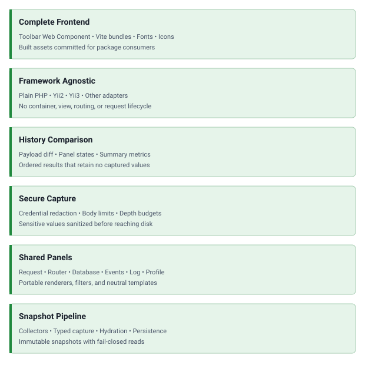

<!-- markdownlint-disable MD041 -->
<p align="center">
    <a href="https://github.com/php-forge/debug-core" target="_blank">
      
    </a>
    <h1 align="center">Debug Core</h1>
    <br>
</p>
<!-- markdownlint-enable MD041 -->

<p align="center">
    <a href="https://github.com/php-forge/debug-core/actions/workflows/build.yml" target="_blank">
        
    </a>
    <a href="https://dashboard.stryker-mutator.io/reports/github.com/php-forge/debug-core/main" target="_blank">
        
    </a>
    <a href="https://github.com/php-forge/debug-core/actions/workflows/static.yml" target="_blank">
        
    </a>
    <a href="https://github.com/php-forge/debug-core/actions/workflows/security.yml" target="_blank">
        
    </a>
</p>

<p align="center">
    <strong>A framework-agnostic PHP core providing snapshots, storage, and the complete frontend for debugger adapters.</strong>
</p>

## Features

<picture>
    <source media="(min-width: 768px)" srcset="./docs/svgs/features.svg">
    
</picture>

## Installation

Install an adapter, not this package. Debug Core is pulled in transitively:

- [`yii2-extensions/debug`](https://github.com/yii2-extensions/debug)
- [`yii3/debug`](https://github.com/yii3/debug)

If you develop an adapter:

```bash
composer require php-forge/debug-core
```

PHP 8.3 or later and the `ctype`, `intl`, and `mbstring` extensions are required.

## Adapter boundary

The core owns snapshot capture, persistence, comparison, and the shared UI. A framework adapter remains responsible
for:

- collecting framework data and converting it into immutable snapshots;
- exposing the toolbar data endpoints and deciding when a response receives the toolbar;
- defining and publishing assets through its own framework;
- rendering the shared templates with its view component;
- routes, controllers, URL generation, panel metadata, and framework-specific panel views;
- implementing `Routing\DebugUrlGeneratorInterface` so portable renderers build panel links without a framework URL
  manager.

The adapter-facing API is documented in the source PHPDoc under `src/`.

## Frontend development

The frontend source lives in `resources/src` and Vite builds it into `resources/assets/dist`. Rebuild and verify with:

```bash
npm install
npm run format:check
npm run lint:js
npm run lint:css
npm run test:js
npm run build
```

## Package information

[](https://www.php.net/releases/8.3/en.php)
[](https://github.com/php-forge/debug-core/actions/workflows/static.yml)
[](https://packagist.org/packages/php-forge/debug-core)
[](https://packagist.org/packages/php-forge/debug-core)

## Code quality

[](https://codecov.io/gh/php-forge/debug-core)
[](https://github.com/php-forge/debug-core/actions/workflows/quality.yml)
[](https://github.com/php-forge/debug-core/actions/workflows/assets.yml)
[](https://github.styleci.io/repos/php-forge/debug-core?branch=main)

## Social networks

[](https://x.com/Terabytesoftw)

## License

[](LICENSE)
